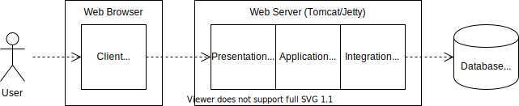

# Project Academia

####  [Link to ::: The software-documentation from developers](https://github.com/macivo/Academia-Webapplication/blob/main/src/site/markdown/product/software-documentation.md)
-----
## Content

- **[Architecture](#architecture)**
- **[Installation](#installation)**
  - [PostgreSQL Database](#postgresql-database)
  - [Tomcat Web Server](#tomcat-web-server)
- **[Build and Run](#build-and-run)**
  - [Production](#production)
  - [Testing](#testing)
- **[Continuous Integration](#continuous-integration)**
- **[Trial accounts for test](#trial-accounts-for-test)**


## Architecture

In the **Academia** project, a student administration software is developed. The software has a 3-tier architecture, consisting of a web browser, a web server and a database server.

For production purposes, a [Tomcat](https://tomcat.apache.org/) web server and a [PostgreSQL](https://www.postgresql.org/) database are used. For testing puposes, an embedded [Jetty](https://www.eclipse.org/jetty/) web server and the in-memory [H2](https://h2database.com/) database are used.



In the web browser, a JavaScript client runs. In the web server, a Java application runs which has a layer architecture:
- The presentation layer provides a REST interface (using Servlets)
- The application layer contains the application logic
- The integration layer implements the data access (using JDBC)


## Installation

### PostgreSQL Database

- Download the PostgreSQL Database software from https://www.postgresql.org/download/
- Install the software using **postgres** as superuser password and **5432** as server port
- Set the environment variable `POSTGRES_HOME` to the installation directory and add its `bin` subdirectory to the system path, e.g.
  ```
  set POSTGRES_HOME=C:\Program Files\PostgreSQL\12
  set PATH=%PATH%;%POSTGRES_HOME%\bin
  ```
- Start the database server if it is not already running
  ```
  pg_ctl start -D "%POSTGRES_HOME%\data"
  ```
- Create the Academia database
  ```
  createdb -U postgres academia
  ```
- Create the Academia database tables and insert data
  ```
  psql -U postgres -d academia -f src/etc/create.sql
  psql -U postgres -d academia -f src/etc/init.sql
  ```
- Run the PostgreSQL interactive terminal and test the data
  ```
  psql -U postgres academia
  academia=# SELECT * FROM module;
  exit
  ```  
- Stop the database server when finished with the project
  ```
  pg_ctl stop
  ```

Further information can be found in the [PostgreSQL documentation](https://www.postgresql.org/docs/13/index.html).


### Tomcat Web Server

- Download and extract the ZIP archive of Tomcat 9 from https://tomcat.apache.org/download-90.cgi
- Set the environment variable `TOMCAT_HOME` to the installation directory and its `bin` subdirectory to the system path, e.g.
  ```
  set CATALINA_HOME=C:\apache-tomcat-9.0.35
  ```
- Start the Tomcat server
  ```
  %CATALINA_HOME%\bin\startup
  ```

Further information can be found in the [Tomcat documentation](https://tomcat.apache.org/tomcat-9.0-doc/index.html).


## Build and Run

The Maven configuration allows building, testing and documenting the application. Unit tests as well as integration tests can be executed. In addition, the byte code is instrumented by the [JaCoCo](https://www.jacoco.org/) plugin such that test coverage metrics are generated.

### Production

For production purposes, the application is compiled and packaged into a web archive (WAR file). This web archive is then deployed to a running Tomcat web server.

- Generate the application documentation
  ```
  mvn site
  ```
- Build the application creating a web archive
  ```
  mvn package
  ```
- Copy the web archive to the Tomcat server
  ```
  copy target\academia-1.0-SNAPSHOT.war %CATALINA_HOME%\webapps\ROOT.war
  ```
- Open a web browser at [http://localhost:8080](http://localhost:8080) and test the application

### Testing

For testing purposes, the application is run using an embbedded Jetty web server and the in-memory database H2. The SQL file `src/etc/create.sql` is automatically executed when connecting to the database.

- Execute the unit tests
  ```
  mvn test -Ptest
  ```
- Execute the unit and integration tests
  ```
  mvn verify -Ptest
  ```
- Execute the tests and generate the documentation including the test reports
  ```
  mvn verify site -Ptest
  ```


## Continuous Integration

When pushing onto the master branch, a GitLab pipeline is activated which executes the build, unit testing, integration testing and documentation phases. On success (i.e., neither the unit tests nor the integration tests fail) the generated documentation is published on GitLab Pages.

## Trial accounts for test
```
  A professor
  Username: professor
  Password: 12345
  
  A Student
  Username: vogtr
  Password: 12345
  
  An Administrator
  Username: admin
  Password: 12345
  ```
